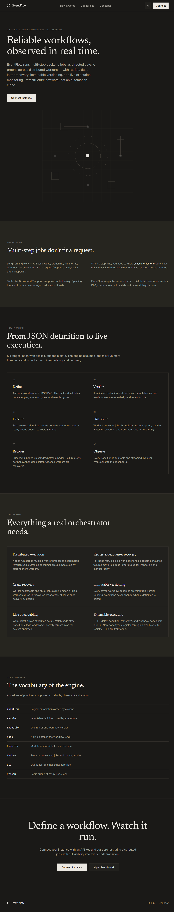
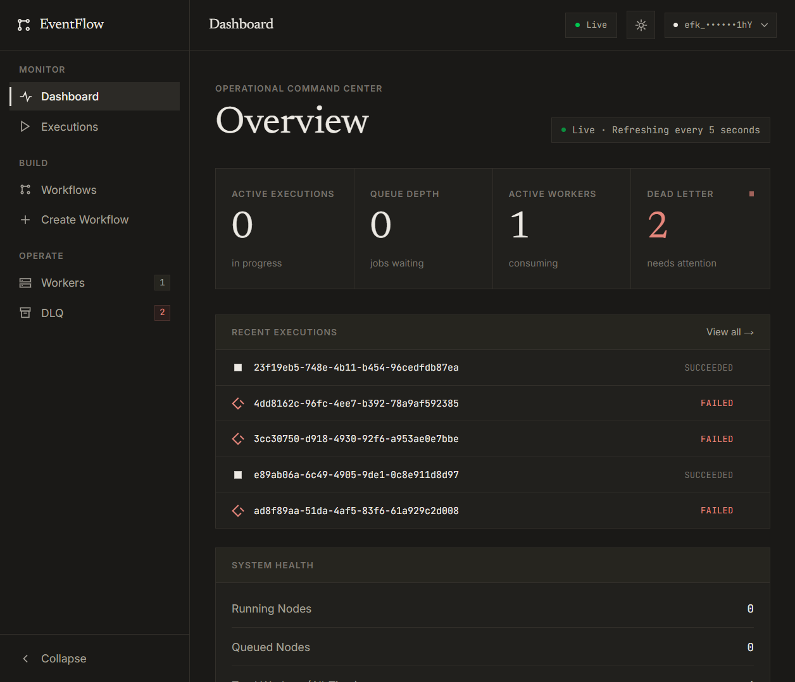
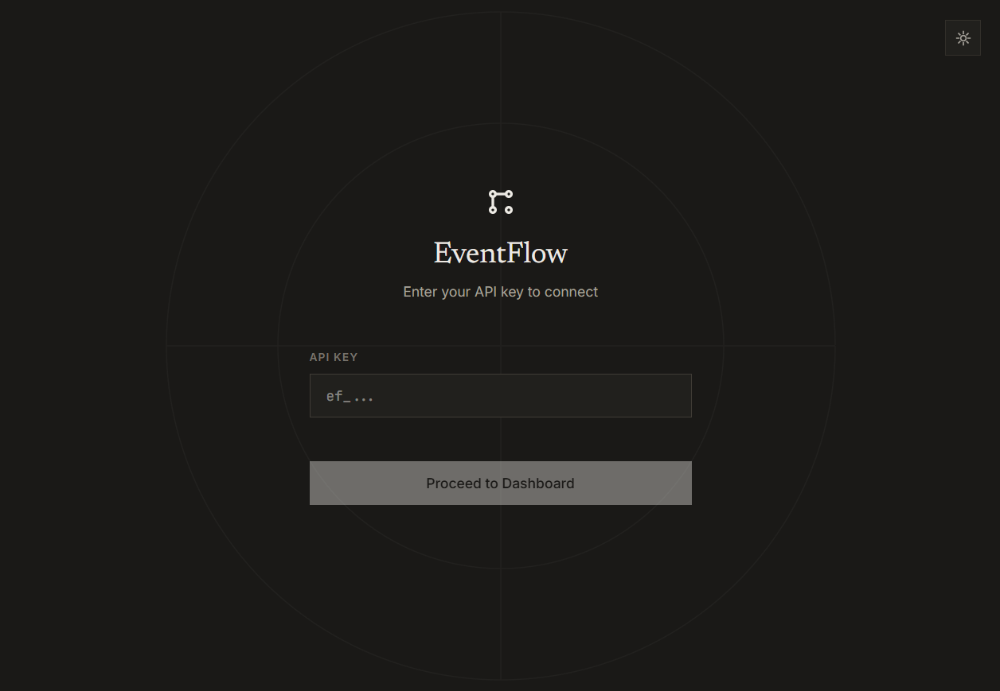

# EventFlow

[](LICENSE)
[](https://www.python.org/)
[](https://fastapi.tiangolo.com/)
[](https://nextjs.org/)

EventFlow is a distributed workflow orchestration engine designed to execute, monitor, and scale graph-based task pipelines across worker clusters. Built on FastAPI, SQLAlchemy, Redis Streams, and Next.js, EventFlow provides deterministic task execution, failure recovery, and state tracking for asynchronous distributed processes.

Modern infrastructure applications require task execution systems that survive worker crashes, network partitions, and transient downstream outages without corrupting state or dropping jobs. EventFlow solves this by decoupling request ingestion, queueing, and task execution. By pairing Redis Streams for message queueing with PostgreSQL for ACID-compliant state management, EventFlow delivers at-least-once execution guarantees, structured retry handling, and automatic recovery of orphaned execution nodes.



---

## Contents

- [Tech Stack](#tech-stack)
- [Core Concepts](#core-concepts)
- [Architecture](#architecture)
- [Execution Lifecycle](#execution-lifecycle)
- [Features](#features)
- [Reliability Features](#reliability-features)
- [Transport Layer](#transport-layer)
- [Design Philosophy](#design-philosophy)
- [Interface Showcase](#interface-showcase)
- [Setup & Usage](#setup--usage)
- [API Authentication](#api-authentication)
- [Demo Workflows](#demo-workflows)
- [Project Structure](#project-structure)
- [Future Roadmap](#future-roadmap)
- [License](#license)

---

## Tech Stack

| Category | Technology | Purpose |
| :--- | :--- | :--- |
| **Backend Framework** | Python 3.10+ / FastAPI | Async HTTP engine, API routing, dependency injection, and middleware |
| **State Persistence** | PostgreSQL / SQLAlchemy 2.0 | Transactional state management, workflow definitions, and audit logs |
| **Database Migrations** | Alembic | Declarative schema management and database migration tracking |
| **Queue & Messaging** | Redis Streams | Persistent message queue with consumer group tracking and explicit ACKs |
| **Transport Layer** | REST / gRPC (Protobuf) | Flexible communication mechanisms between worker nodes and backend services |
| **Frontend Framework** | Next.js 14 / React 18 | Dashboard interface, client-side routing, and real-time execution monitoring |
| **Styling & Design** | Tailwind CSS / Custom Tokens | Editorial, monochrome design system with zero-radius geometry |
| **Orchestration** | Docker Compose | Containerized service orchestration for local development and deployment |

---

## Core Concepts

Understanding the foundational abstractions behind EventFlow:

### Workflows
A workflow represents a Directed Acyclic Graph (DAG) consisting of execution nodes and directed edges. Workflows define the structural logic of a pipeline, including HTTP calls, conditional branching, delays, and failure handling rules.

### Executions
An execution is an instantiated run of a specific workflow version. Each execution tracks the input payload, global execution status (`RUNNING`, `COMPLETED`, `FAILED`), start/end timestamps, and individual node execution states.

### Workers
Workers are stateless background consumer processes that poll the queue for runnable task payloads, execute the node logic against third-party endpoints or internal functions, and emit status updates back to the primary engine.

### Redis Streams
Redis Streams act as the durable message broker. Using Consumer Groups, Redis Streams guarantee message distribution across multiple worker instances, preserving message order and maintaining pending entry lists (PEL) for unacknowledged jobs.

### PostgreSQL
PostgreSQL acts as the single source of truth for durable system state. While Redis handles transient job delivery, PostgreSQL stores workflow definitions, execution history, node execution logs, API keys, and retry attempt counters.

### Retry Policies
Configurable rules attached to workflow nodes that dictate failure handling. Retry policies specify maximum attempt thresholds and execution conditions prior to marking a node as dead-lettered.

### Dead Letter Queue (DLQ)
A specialized isolation queue and database record for jobs that have exhausted their configured retry limits. Jobs in the DLQ are held in a terminal failure state to prevent queue head-of-line blocking while preserving full diagnostic contexts for operator inspection.

### Heartbeats
Periodic signal messages transmitted by active workers back to the control plane. Heartbeats maintain worker registration records, communicate resource availability, and update the worker's operational state (`STARTING`, `IDLE`, `BUSY`, `OFFLINE`).

### Recovery
An automated control plane background process that inspects active worker heartbeats and pending queue messages. If a worker fails or disconnects while executing a task, the recovery system reclaims abandoned jobs and re-queues them for healthy workers.

---

## Architecture

```text
                        ┌─────────────────────────────────────┐
                        │      Next.js Dashboard / Client     │
                        └──────────────────┬──────────────────┘
                                           │  REST / HTTP
                                           ▼
                        ┌─────────────────────────────────────┐
                        │        FastAPI Control Plane        │
                        └──────────┬──────────────────────┬───┘
                                   │                      │
                   SQLAlchemy 2.0  │                      │ Async Redis Client
                                   ▼                      ▼
                        ┌──────────────────┐    ┌──────────────────┐
                        │  PostgreSQL DB   │    │  Redis Streams   │
                        │  (System State)  │    │ (Message Queue)  │
                        └──────────────────┘    └─────────┬────────┘
                                                          │
                                         Consumer Group   │ Claim / ACK
                                                          ▼
                                            ┌───────────────────────────┐
                                            │   Distributed Workers     │
                                            │  (REST / gRPC Transport)  │
                                            └───────────────────────────┘
```

### End-to-End System Flow

1. **Invocation**: A client submits an execution request via the REST API specifying a `workflow_version_id` and initial input JSON payload.
2. **State Initialization**: The FastAPI control plane validates the workflow DAG schema, verifies API key credentials, creates a root `Execution` record, and instantiates child `NodeExecution` records in PostgreSQL with `PENDING` status.
3. **Task Enqueueing**: Root nodes with no incoming dependencies are marked as `QUEUED`, serialized into payload payloads, and pushed to the designated Redis Stream topic.
4. **Worker Consumption**: Active worker instances listening on the Redis Stream consumer group claim pending job messages (`XREADGROUP`). The worker transitions its local status to `BUSY` and emits a heartbeat.
5. **Node Execution**: The worker executes the task logic corresponding to the node type (e.g., executing an HTTP request or evaluating a boolean expression).
6. **State Synchronization**: Upon completion, the worker communicates the execution outcome (`SUCCEEDED`, `FAILED`, `RETRYING`) back to the control plane via REST or gRPC transport.
7. **DAG Traversal**: The control plane updates node state in PostgreSQL. If the node succeeded, downstream dependent nodes are evaluated. If all incoming edge dependencies are satisfied, child nodes are transitioned to `QUEUED` and published to Redis Streams.
8. **Finalization**: When all terminal nodes complete, the root `Execution` is marked as `COMPLETED`.

---

## Execution Lifecycle

The lifecycle of an EventFlow task follows a deterministic state machine:

```text
[ Created ] ──► [ Execution Started ] ──► [ Node Queued ] ──► [ Worker Claims Job ]
                                                                      │
                                                                      ▼
[ Completion ] ◄── [ Execution Stored ] ◄── [ Node Succeeded ] ◄──────┴──────► [ Node Failed ]
       ▲                                                                             │
       │                                                                             ▼
       └─────────────────────────── [ DLQ (Exhausted) ] ◄─── [ Retry Policy Check ]
```

1. **Workflow Created**: The workflow definition is submitted, validated for acyclic integrity, versioned, and saved in PostgreSQL.
2. **Execution Started**: An execution instance is triggered manually or via API. Root execution records enter the `RUNNING` state.
3. **Node Queued**: Eligible DAG nodes enter `QUEUED` status and are published to Redis Streams.
4. **Worker Claims Job**: A worker node fetches the job from the Redis Stream consumer group, moving it to the pending entry list.
5. **Execution Stored**: The worker executes the task executor logic. Result payloads, HTTP status codes, and execution durations are recorded.
6. **Retry on Failure**: If an execution throws an exception or returns a failure result, the node evaluates its `RetryPolicy`. If attempts remain below `max_attempts`, the attempt counter increments and the job is re-enqueued with exponential backoff delay.
7. **DLQ if Exhausted**: If retries are exhausted without success, the node moves to `DEAD_LETTERED`. A record is written to the `DeadLetterJob` table, capturing failure reasons, payload state, and stack traces.
8. **Completion**: Once all path nodes reach a terminal state (`SUCCEEDED` or `DEAD_LETTERED`), the parent workflow execution transitions to `COMPLETED` or `FAILED`.

---

## Features

### Workflow Engine
- **Graph-Based DAG Execution**: Supports complex dependency graphs, parallel execution branches, and conditional routing.
- **Pluggable Executors**: Built-in executors for HTTP requests, delays, and boolean condition evaluations.
- **DAG Schema Validation**: Automated verification of workflow acyclicity and node connection validity prior to execution.

### Reliability
- **At-Least-Once Delivery**: Redis Streams consumer groups ensure messages are never lost during worker failure.
- **Automated Stuck Job Recovery**: Periodic background scanner identifies unacknowledged jobs from dead workers and reassigns them.
- **Exponential Backoff Retries**: Configurable per-node retry limits with automatic scheduling.
- **Isolated Dead Letter Queue**: Failed tasks are isolated for manual inspection without blocking pipeline execution.

### Distributed Execution
- **Horizontal Scaling**: Add or remove worker processes seamlessly without engine downtime.
- **Worker Heartbeat Tracking**: Real-time worker health, hostname, current job ID, and active status tracking.
- **Dual Transport Mode**: Pluggable support for REST and gRPC execution transport layers.

### Security
- **API Key Authentication**: Secure endpoint protection using API key headers (`X-EventFlow-API-Key` or Bearer tokens).
- **Hashed Storage**: Raw keys are generated once using 256-bit entropy (`secrets.token_urlsafe(32)`); only SHA-256 digests are stored.
- **Tenant Isolation**: Workflow execution, DLQ records, and worker instances are strictly scoped to owner API key identities.
- **Hashed Refresh Token Rotation**: Database-backed JWT refresh token rotation with family reuse detection and automatic revocation.

### Developer Experience
- **Database Seeding**: Built-in CLI scripts for populating ready-to-run demo workflows and generating administrative API keys.
- **Automated Migrations**: Complete database schema versioning powered by Alembic.
- **Comprehensive Test Suite**: Unit and integration test coverage with `pytest` and `httpx`.

### Dashboard
- **Monochrome Editorial Interface**: Calm, high-density monitoring UI built with Next.js and Tailwind CSS.
- **Live Status Monitoring**: Real-time visualization of workflow executions, worker node health, and queue metrics.
- **DLQ Management**: Detailed inspection of dead-lettered job payloads, error logs, and execution traces.

---

## Reliability Features

| Feature | Purpose | Benefit |
| :--- | :--- | :--- |
| **Retry Policies** | Automatically re-execute failing nodes up to a specified threshold | Handles transient network glitches and downstream API downtime without manual intervention |
| **Dead Letter Queue** | Isolate repeatedly failing jobs into a quarantined queue state | Prevents failing jobs from blocking queue consumption while preserving complete error diagnostics |
| **Worker Heartbeats** | Periodically ping the control plane with worker operational state | Provides immediate visibility into node health, active jobs, and offline worker instances |
| **Stuck Job Recovery** | Scan Redis Streams Pending Entry Lists (PEL) for unacknowledged messages | Automatically reclaims and re-assigns tasks left orphaned by crashed worker processes |
| **Durable Queue** | Persist task messages to disk using Redis Streams | Ensures job messages survive message broker restarts and transient cluster disruptions |
| **Persistent State** | Record every state transition, log entry, and execution payload to PostgreSQL | Guarantees ACID durability, historical auditability, and deterministic status tracking |

---

## Transport Layer

EventFlow supports dual transport protocols for internal communication between the control plane and distributed worker nodes: **REST** and **gRPC**.

### REST Transport
The default transport protocol uses HTTP/1.1 REST endpoints. Workers communicate with the central control plane using standard JSON payloads over HTTP.

### gRPC Transport
An optional high-performance transport layer built on Protocol Buffers (Protobuf) and gRPC. When enabled, workers exchange binary-encoded RPC messages with the backend control plane.

### Protocol Comparison

| Characteristic | REST Transport | gRPC Transport |
| :--- | :--- | :--- |
| **Payload Format** | JSON (Text) | Protocol Buffers (Binary) |
| **Protocol** | HTTP/1.1 | HTTP/2 |
| **Performance** | Standard serialization overhead | Low latency, compact binary footprint |
| **Debugging** | Human-readable inspection in web proxies | Requires Protobuf schema decoding |
| **Default Usage** | Default development mode | High-throughput production environments |

### Configuring the Transport Layer

The transport mode is governed by the `EVENTFLOW_INTERNAL_TRANSPORT` environment variable.

To enable **gRPC transport** across your cluster, set the variable in your environment or `docker-compose.yml`:

```yaml
# docker-compose.yml
services:
  backend:
    environment:
      - EVENTFLOW_INTERNAL_TRANSPORT=grpc
  worker-1:
    environment:
      - EVENTFLOW_INTERNAL_TRANSPORT=grpc
  worker-2:
    environment:
      - EVENTFLOW_INTERNAL_TRANSPORT=grpc
```

> [!NOTE]
> When switching transports in Docker Compose, recreate the containers using `docker compose up -d` to ensure environment changes are propagated across all nodes.

---

## Design Philosophy

The EventFlow dashboard follows a **monochrome, typography-first editorial design system** inspired by high-density technical documentation and minimalist publishing interfaces. 

```text
┌─────────────────────────────────────────────────────────────────────────────┐
│ EventFlow  /  Workers                                 ● Live  [ demo-owner ]│
├─────────────────────────────────────────────────────────────────────────────┤
│                                                                             │
│  Workers                                                 [ Spawn Worker ]   │
│  Distributed worker instances consuming and executing workflow nodes.       │
│                                                                             │
│  ┌───────────────────────────────────────────────────────────────────────┐  │
│  │ WORKER ID               HOSTNAME       STATUS    HEARTBEAT    JOB ID  │  │
│  ├───────────────────────────────────────────────────────────────────────┤  │
│  │ worker-node-01          host-prod-a    IDLE      2s ago       —       │  │
│  │ worker-node-02          host-prod-b    BUSY      1s ago       job_8f2 │  │
│  └───────────────────────────────────────────────────────────────────────┘  │
└─────────────────────────────────────────────────────────────────────────────┘
```

### Design Principles

#### Typography as Hierarchy
Visual structure is driven by type scale, font pairing, and whitespace rather than artificial containers or bright background colors:
- **Newsreader** (Serif): Used for high-level page titles, section headers, and brand marks, lending a calm, technical publication character.
- **Inter** (Sans-Serif): Used for body text, navigation elements, form controls, and tabular data.
- **JetBrains Mono** (Monospace): Used for technical IDs, checksums, HTTP status codes, payloads, and timing metrics.

#### Strict Color Restraint
Standard dashboards suffer from visual noise caused by multi-colored status badges, glowing neon accents, and dark/light gradients. EventFlow avoids this cognitive fatigue through a warm-gray monochrome palette:
- **Light Mode**: Warm paper background (`#faf9f7`), pure white card surfaces, and graphite ink (`#292724`).
- **Dark Mode**: Warm charcoal background (`#1a1917`), layered surface tones (`#21201d`), and off-white ink (`#ece9e3`).
- **Zero Accent Colors**: Primary interactive elements use **inverse fill** (dark background with light text in light mode).
- **Single Reserved Semantic (`--danger`)**: Muted red is reserved exclusively for destructive actions, failed node states, and DLQ errors. It is never used decoratively.

#### Geometry & Shapes
- **Zero Border Radius**: Cards, buttons, text inputs, and table headers feature sharp 90-degree corners (0px roundedness) to emphasize an engineered structure.
- **Semantic Status Symbols**: Operational states are communicated via geometric indicators rather than standard traffic-light pills:
  - `Running`: Rotating 1px stroke ring.
  - `Completed`: Solid square fill.
  - `Queued`: Hollow square outline.
  - `Retrying`: Double circle stroke.
  - `Failed`: Broken diamond in muted red.
  - `Dead-Lettered`: Dashed square in muted red.

#### Elevation via Tonal Layering
EventFlow eliminates drop shadows, blurs, and glassmorphism. Depth is created strictly through subtle surface shifts (`surface`, `surface-2`) delimited by 1px hairline border strokes.

---

## Interface Showcase

### Operational Command Center
Overview dashboard displaying active executions, message queue depth, active worker node metrics, and dead-letter queue count.



### Visual DAG Workflow Canvas
Interactive workflow construction interface allowing drag-and-drop node creation, parameter configuration, and connection routing.

.png)

### Workflow Definitions & Versions
List of active workflow definitions, version checksums, and metadata.

.png)

### Global Execution History
Live updating ledger of global workflow executions with status indicators and start/completion timestamps.

.png)

### Distributed Worker Node Telemetry
Real-time worker process monitoring, hostname details, heartbeat recency, and current task assignments.

.png)

### Dead Letter Queue (DLQ) & Remediation
Dedicated isolation interface for inspecting failed execution nodes, attempt counts, exception tracebacks, and manual resolution controls.

.png)

### API Key Authentication Portal
Monochrome authentication portal enforcing API key credential verification.



---

## Setup & Usage

### Prerequisites
- **Docker** (v20.10+) and **Docker Compose** (v2.0+)
- **Python 3.10+** (if running locally outside Docker)
- **Node.js 18+** (if running frontend locally outside Docker)

### 1. Environment Configuration
Clone the repository and copy the example environment configuration files:

```bash
# Clone the repository
git clone https://github.com/guptakaran20/EventFlow.git
cd EventFlow

# Create backend environment file
cp backend/.env.example backend/.env

# Create frontend environment file
cp frontend/.env.local.example frontend/.env.local
```

### 2. Start the Cluster
Launch the full containerized stack using Docker Compose. This spins up PostgreSQL, Redis, the FastAPI backend control plane, two background worker instances, and the Next.js frontend:

```bash
docker compose up -d --build
```

### 3. Run Database Migrations
Once the database container is healthy, apply the Alembic migrations to set up the database tables:

```bash
docker compose exec backend alembic upgrade head
```

### 4. Generate an API Key
Generate an initial administrative API key to authenticate requests against the engine:

```bash
docker compose exec backend python scripts/create_api_key.py "Admin Key"
```

> [!IMPORTANT]
> The raw API key (prefixed with `efk_`) is printed **once** in your terminal. Copy and store it immediately. Only its SHA-256 hash is persisted in PostgreSQL.

### 5. Seed Demo Workflows
Populate the system with pre-configured demo workflows to test execution paths, conditional branching, delays, and retry behavior:

```bash
docker compose exec backend python scripts/seed_demo_workflows.py
```

### 6. Access the Dashboard
Open your browser and navigate to `http://localhost:3000`. You can paste your generated API key into the dashboard to start executing and monitoring workflows.

---

## API Authentication

EventFlow enforces API key authentication for all control plane REST and gRPC endpoints.

### Key Structure & Generation
1. **Entropy**: Raw keys are generated using Python's `secrets.token_urlsafe(32)`, providing 256 bits of cryptographically secure entropy.
2. **Prefix**: All generated keys are prefixed with `efk_` (e.g., `efk_3Wm5rCXS...`) for immediate identification in logs or secret scanners.
3. **One-Time Display**: The raw key string is displayed to the user only at the time of creation and is never stored in plaintext.

### Hashed Storage Model
To protect against credential exposure in database dumps or snapshot leaks, EventFlow stores only the **SHA-256 hash** of each API key:

```text
Raw Key (Client Header) ──► SHA-256 Digest ──► DB Lookup (key_hash == digest)
```

When a request is received:
1. The incoming key string from the `X-EventFlow-API-Key` header (or `Authorization: Bearer` header) is extracted.
2. The control plane hashes the incoming key string using SHA-256.
3. A indexed lookup matches the resulting hash against `api_keys.key_hash`.
4. If valid and active (`is_active = True`), the request principal is authenticated and attached to the execution context.

---

## Demo Workflows

The `scripts/seed_demo_workflows.py` script populates four workflows demonstrating core engine execution patterns:

### 1. Linear HTTP Demo
- **Pattern**: Sequential task chain.
- **Execution Flow**: Executes an initial HTTP GET request to fetch remote data (`/todos/1`), and upon success, triggers a second sequential HTTP GET request (`/todos/2`).
- **Demonstrates**: Dependency chaining, output serialization, and sequential graph evaluation.

### 2. Condition Demo
- **Pattern**: Conditional branching.
- **Execution Flow**: Evaluates a boolean condition node (`input.value > 10`). Routes execution to `true_path` if satisfied, or `false_path` if unsatisfied.
- **Demonstrates**: Dynamic DAG branch evaluation and non-selected path pruning.

### 3. Delay Demo
- **Pattern**: Asynchronous time delay.
- **Execution Flow**: Pauses execution at a `delay` node for a specified duration (e.g., 10 seconds) before resuming the downstream HTTP request.
- **Demonstrates**: Non-blocking worker sleeping, state suspension, and delayed queue resumption.

### 4. Retry & DLQ Demo
- **Pattern**: Resilience and Dead Letter Queue isolation.
- **Execution Flow**: Intentionally targets a failing HTTP endpoint (`httpbin.org/status/500`) with a configured `RetryPolicy(max_attempts=3)`.
- **Demonstrates**: Exponential backoff evaluation, attempt tracking, retry limit exhaustion, and automatic transition to `DEAD_LETTERED` status.

---

## Project Structure

```text
EventFlow/
├── backend/                       # Python FastAPI Backend & Worker Service
│   ├── alembic/                   # Database migration environment & versions
│   │   └── versions/              # Declarative schema version scripts
│   ├── app/                       # Application core package
│   │   ├── api/                   # REST API route handlers
│   │   │   ├── auth.py            # Token generation, login, & refresh rotation
│   │   │   ├── dlq.py             # Dead Letter Queue inspection endpoints
│   │   │   ├── executions.py      # Execution management & logs API
│   │   │   ├── metrics.py         # Engine telemetry & aggregate counts
│   │   │   ├── workers.py         # Worker registration & control API
│   │   │   └── workflows.py       # DAG definition CRUD & validation API
│   │   ├── core/                  # Engine configurations, security, & errors
│   │   │   ├── config.py          # pydantic-settings configuration models
│   │   │   ├── errors.py          # Centralized error codes & exception handlers
│   │   │   └── security.py        # API key verification & JWT operations
│   │   ├── db/                    # SQLAlchemy database session setup & models
│   │   ├── models/                # SQLAlchemy ORM database models
│   │   ├── queue/                 # Redis Streams queue publisher & consumer
│   │   ├── schemas/               # Pydantic request/response validation schemas
│   │   ├── services/              # Business logic services (DAG, Service, Worker)
│   │   ├── transport/             # gRPC server/client transport abstractions
│   │   └── worker/                # Worker daemon runtime, heartbeats, & recovery
│   └── scripts/                   # CLI scripts for database seeding & key generation
│       ├── create_api_key.py      # Script to issue new API keys
│       └── seed_demo_workflows.py # Script to populate seed workflows
├── frontend/                      # Next.js 14 Dashboard Application
│   ├── src/                       # Source code directory
│   │   ├── app/                   # Next.js App Router pages & layouts
│   │   ├── components/            # Reusable UI components & navigation
│   │   └── lib/                   # API client utilities & TypeScript types
│   └── public/                    # Static assets & icons
├── images/                        # Platform screenshots & UI assets
├── proto/                         # Protocol Buffer definitions for gRPC transport
│   └── execution.proto            # Execution service message & RPC definitions
├── docker-compose.yml             # Multi-service Docker orchestrator
├── DESIGN.md                      # Complete UI design system spec & design guidelines
├── LICENSE                        # MIT Open Source License
└── README.md                      # Project documentation
```

---

## Future Roadmap

The following enhancements represent planned architectural additions to EventFlow:

- **Workflow Versioning & Migration Tools**: In-place schema migration utilities for active executions when workflow DAG definitions update.
- **Cron & Schedule Engine**: Recurring time-based workflow triggering powered by a distributed cron scheduler.
- **Event-Driven Ingestion**: Webhook ingestion gateways to trigger workflow executions from external cloud events (e.g., GitHub, Stripe).
- **Prometheus & OpenTelemetry Integration**: Native exporter endpoints for engine metrics, task latencies, worker throughput, and distributed tracing.
- **Role-Based Access Control (RBAC)**: Fine-grained permissions layer restricting access to workflow definitions, execution triggers, and system configuration.
- **Kubernetes Deployment Manifests**: Official Helm charts and Kubernetes Operator for scaling worker pods dynamically via KEDA.

---

## License

EventFlow is open-source software licensed under the [MIT License](LICENSE).
